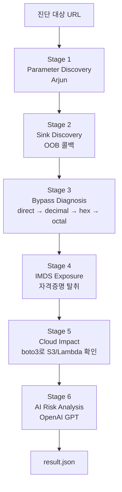

# SSRF → Cloud 자동 진단 도구

SSRF 취약점 하나로 시작해서 **IMDS 자격증명 탈취 → S3/Lambda 접근 범위**까지 한번에 진단하는 자동화 파이프라인. 2019년 Capital One 침해사고 시나리오를 그대로 재현하고, 결과를 LLM이 요약해서 위험도·대응방안을 리포트한다.

> **개발**: 진단 도구 팀 (김태회, 안준엽, 조윤호) — SK쉴더스 루키즈 33기 모듈 프로젝트 2

---

## 1. 개요

- **입력**: 진단 대상 웹 URL (예: `http://target/fetch`)
- **처리**: 6-stage 파이프라인 자동 실행
- **출력**: 우회 성공 여부 + 자격증명 탈취 여부 + 실질 클라우드 권한 + AI 위험도 판단이 담긴 JSON 리포트

## 2. 파이프라인 흐름



각 stage는 이전 stage의 JSON 결과를 입력받아 자기 결과를 붙여 다음으로 넘긴다.

---

## 3. 파일 구성

### 3.1 진단 파이프라인 (핵심)

| 파일 | 역할 |
|---|---|
| `main.py` | 전체 파이프라인 오케스트레이터. CLI 진입점 |
| `payloads.py` | 우회 기법별 페이로드 생성기 (10진수/16진수/8진수 IP 변환) |
| `stage1_parameter_discovery.py` | Arjun 실행 → 파라미터 목록 추출 |
| `stage2_sink_discovery.py` | 콜백 URL 주입 → 콜백 서버 hit 여부로 SSRF sink 판정 |
| `stage3_bypass_diagnosis.py` | 우회 기법 순차 시도 + 응답 분류(success/bypass_only/blocked) |
| `stage4_imds_exposure.py` | IMDS 접근 + IAM Role 조회 + 임시 자격증명 탈취 (마스킹) |
| `stage5_cloud_impact.py` | 탈취 자격증명으로 boto3 호출 → S3/Lambda 접근 범위 확인 |
| `stage6_ai_analysis.py` | 전 stage 결과를 OpenAI에 전달 → 위험도/근거/대응방안 |

### 3.2 로컬 테스트 전용 (git에 올려두지만 실환경 진단시 실행 안 함)

| 파일 | 역할 |
|---|---|
| `callback_server.py` | Stage 2에서 사용할 OOB 콜백 서버 (Flask, port 9000) |
| `mock_vulnerable_app.py` | 로컬 취약 웹앱(port 5000) + mock IMDS 서버(port 5001) |
| `smoke_test.py` | 로컬 mock 대상 end-to-end 통합 테스트 |

> 실제 팀 웹서버(`web/app.py`)나 EC2 대상으로 진단할 땐 `mock_vulnerable_app.py`는 실행 안 함. `callback_server.py`는 로컬 진단 시에는 필요, EC2 대상 진단 시에는 `--skip-sink` 옵션으로 대체 가능.

### 3.3 기타

| 파일 | 역할 |
|---|---|
| `requirements.txt` | Python 의존성 목록 |
| `README.md` | 이 문서 |

---

## 4. 요구사항

- Python 3.10+
- Arjun 2.2.7 (`pip install arjun`)
- (선택) OpenAI API 키 — 없으면 규칙기반 폴백으로 동작
- (선택) AWS 리전 접근 권한 — Stage 5용

## 5. 설치

```bash
pip install -r requirements.txt
```

`.env` 파일 (프로젝트 루트):

```
OPENAI_API_KEY=sk-...
```

`.env`는 절대 커밋 금지 (`.gitignore`에 포함되어 있어야 함).

---

## 6. 실행 방법

### 6.1 로컬 스모크 테스트 (mock 서버 대상)

파이프라인 자체가 잘 도는지 빠르게 확인용. 서버들을 자동 기동해서 전 stage를 검증한다.

```bash
python smoke_test.py
```

마지막에 `[✓] 전체 파이프라인 스모크 테스트 완료` 뜨면 OK.

### 6.2 팀 웹서버 대상 진단 (로컬)

로컬에서 팀의 `web/app.py`를 대상으로 우회 진단만 검증. Stage 4~5는 mock IMDS가 없으면 skipped 처리됨.

> 로컬에서는 필터 레벨을 URL 파라미터 `?level=N` 으로 전달할 수 있어 `--extra level=N` 옵션 사용. AWS 배포 환경(§6.3)에서는 웹 UI로 레벨을 설정하므로 이 옵션 불필요.

**터미널 1** — 팀 웹서버
```bash
python web/app.py
```

**터미널 2** — 콜백 서버
```bash
python callback_server.py
```

**터미널 3** — 진단 실행 (필터 레벨별)
```bash
python main.py http://127.0.0.1:5000/fetch --extra level=0 -o result_L0.json
python main.py http://127.0.0.1:5000/fetch --extra level=1 -o result_L1.json
python main.py http://127.0.0.1:5000/fetch --extra level=2 -o result_L2.json
python main.py http://127.0.0.1:5000/fetch --extra level=3 -o result_L3.json
```

### 6.3 AWS EC2 대상 진단 (실환경)

AWS 배포 환경에서는 필터 레벨을 웹 UI에서 설정하므로 `--extra level=N` 옵션 불필요. 웹 페이지에서 레벨을 변경한 후 진단을 실행하면 된다.

**V1 (IMDSv1 강제, 취약)** — 레벨별로 웹 UI에서 설정 변경 후 각각 실행:
```bash
# 웹 UI에서 Level 0으로 설정 후
python main.py http://<V1_EC2_IP>:5000/fetch -o imdsV1_result_lv0.json

# Level 1로 변경 후
python main.py http://<V1_EC2_IP>:5000/fetch -o imdsV1_result_lv1.json

# Level 2로 변경 후
python main.py http://<V1_EC2_IP>:5000/fetch -o imdsV1_result_lv2.json

# Level 3으로 변경 후
python main.py http://<V1_EC2_IP>:5000/fetch -o imdsV1_result_lv3.json
```

**V2 (IMDSv2 강제, 대조용)**:
```bash
python main.py http://<V2_EC2_IP>:5000/fetch -o result_v2.json
```

V2 대상은 SSRF 필터 우회는 성공해도 IMDSv2 토큰 요구 때문에 Stage 4에서 `reachable: false`로 뜬다. → "필터를 뚫어도 IMDSv2가 있으면 자격증명 못 훔침" 이라는 방어 효과 확인 가능.

---

## 7. CLI 옵션

| 옵션 | 기본값 | 설명 |
|---|---|---|
| `target` (필수, 위치인자) | — | 진단 대상 URL (예: `http://host:port/fetch`) |
| `--method` | `GET` | HTTP 메소드 (`GET`\|`POST`) |
| `--extra key=value` | — | 대상 서버에 추가 파라미터 전달 (반복 가능). 팀 서버의 `level` 지정용 |
| `--skip-sink` | `False` | Stage 2 스킵. 콜백 서버 접근 불가 + 응답 반사도 없는 대상용 fallback |
| `--callback` | `http://127.0.0.1:9000` | 콜백 서버 주소 |
| `--region` | `ap-northeast-2` | AWS 리전 (Stage 5용) |
| `-o`, `--output` | (stdout) | 결과 JSON 저장 경로 |

---

## 8. 결과 JSON 규격

대시보드 팀이 파싱할 최종 결과 스키마:

```json
{
  "meta": {
    "target": "http://...",
    "timestamp": "2026-08-27T..."
  },
  "stages": {
    "parameter_discovery": { "target": "...", "parameters": [...] },
    "sink_discovery":      { "target": "...", "ssrf_candidates": [...] },
    "bypass_diagnosis":    [
      {
        "target": "...",
        "parameter": {"name": "url", "method": "GET", "location": "query"},
        "tests": [
          {"technique": "direct",     "bypassed": false, "verdict": "blocked",     "status_code": 403, "body_snippet": "..."},
          {"technique": "decimal_ip", "bypassed": false, "verdict": "blocked",     "status_code": 403, "body_snippet": "..."},
          {"technique": "hex_ip",     "bypassed": true,  "verdict": "success",    "status_code": 200, "body_snippet": "..."},
          {"technique": "octal_ip",   "bypassed": true,  "verdict": "success",    "status_code": 200, "body_snippet": "..."}
        ],
        "result": "vulnerable",
        "bypass_technique": "hex_ip"
      }
    ],
    "imds_exposure": {
      "imds":                  {"reachable": true, "version_tested": "IMDSv1"},
      "iam_role":              {"detected": true, "role_name": "..."},
      "temporary_credentials": {
        "exposed": true,
        "access_key_id":     "ASIA****REDACTED",
        "secret_access_key": "REDACTED",
        "session_token":     "REDACTED"
      }
    },
    "cloud_impact": {
      "principal":     {"type": "IAMRole", "name": "..."},
      "cloud_impact":  [
        {"service": "S3",     "resource": "...", "permissions": [...], "impact": "read_access"},
        {"service": "Lambda", "resource": "...", "permissions": [...], "impact": "information_disclosure"}
      ],
      "overall_impact": "high"
    }
  },
  "verdict": {
    "risk":            {"severity": "high", "score": 8.0},
    "summary":         "...",
    "evidence":        ["...", "..."],
    "recommendations": ["...", "..."]
  }
}
```

### 8.1 verdict 분류 기준 (Stage 3)

각 `tests` 항목은 두 가지 판정을 함께 담는다:

- `bypassed` (bool) — **필터 우회 성공 여부**. 필터를 뚫었으면 true (IMDS 도달 여부와 무관)
- `verdict` (string) — 응답 상세 분류

| verdict | 의미 |
|---|---|
| `success` | IMDS 실제 응답 도달 (AWS 실환경) → 확정 취약 |
| `bypass_only` | 필터는 뚫었으나 IMDS 미도달 (로컬 환경 or IMDSv2 401) → 우회 성공 판정 |
| `blocked` | 필터에 걸림 → 우회 실패 |
| `unknown` | 판정 불가 |

`success`와 `bypass_only` 모두 `bypassed: true`가 되어 최종 vulnerable 판정에 포함된다. `bypass_technique` 필드에는 첫 번째로 성공한 우회 기법 이름이 담긴다.

### 8.2 impact 등급 (Stage 5)

`no_access` < `enumeration_only` < `information_disclosure` < `read_access` < `write_access`

이 중 가장 높은 값이 `overall_impact`로 산정된다.

### 8.3 severity 등급 (Stage 6)

`info` < `low` < `medium` < `high` < `critical`

---

## 9. 검증 결과 (참고용)

### 9.1 팀 웹서버 로컬, Level별 우회 결과

| Level | 필터 | direct | decimal | hex | octal | 최종 |
|---|---|---|---|---|---|---|
| 0 | 없음 | ✓ | ✓ | ✓ | ✓ | vulnerable |
| 1 | 문자열 블랙리스트 | ✗ | ✓ | ✓ | ✓ | vulnerable |
| 2 | 부분 정규화 (10진수만 차단) | ✗ | ✗ | ✓ | ✓ | vulnerable |
| 3 | 완전 정규화 | ✗ | ✗ | ✗ | ✗ | **safe** |

### 9.2 EC2 실환경 결과 요약 (Level 2)

- successful_technique: `hex_ip`
- IAM Role: `yuk-ssrf-role-full-access`
- 자격증명 탈취: 성공
- S3: `read_access` (list_buckets, list_objects, get_object)
- Lambda: `information_disclosure` (list_functions, get_function)
- 최종 severity: **high (8.0)**

---

## 10. 주의사항

### 자격증명 취급
- Stage 4가 탈취한 자격증명은 `_raw_credentials` 필드로 내부에만 보관되고, Stage 5의 boto3 호출에만 사용됨
- 최종 리포트(`temporary_credentials`)에는 마스킹된 값만 저장됨
- LLM 프롬프트에도 원본 자격증명 절대 포함 안 됨
- 발표 자료/스크린샷에도 반드시 마스킹 확인

### destructive 액션 원칙
- Stage 5 `cloud_impact`는 read/list 계열만 호출
- S3 삭제 등의 destructive 시연은 팀 승인 후에만 수동 진행

### 진단 대상 격리
- 진단 대상은 **팀이 소유·구축한 취약 서버**(로컬 or 팀 AWS 계정)에 한정
- 외부 서비스 대상 스캔 금지

### git 커밋 주의
- `.env`, `*.pem`, 자격증명이 담긴 `result*.json`은 커밋 금지
- `.gitignore` 반드시 확인

---

## 11. 트러블슈팅

**Arjun 실행 시 `AttributeError: 'dict' object has no attribute 'status_code'`**
→ 대상 서버가 파라미터 없이 접근 시 400을 리턴하면 Arjun이 크래시함. 대상 서버가 200 또는 다른 정상 응답을 리턴하도록 확인.

**결과 JSON에서 한글 깨짐 (Windows)**
→ 이미 `main.py`가 `encoding="utf-8"`로 저장하도록 되어있음. 그래도 깨지면 텍스트 에디터의 인코딩 설정 확인.

**Stage 4 role_name이 `null`로 뜸**
→ 팀 웹서버가 응답을 HTML `<pre>`로 감싼 경우. Stage 4의 `_unwrap_html()` 헬퍼가 자동 처리하지만, 다른 형식으로 감싼다면 이 함수 수정 필요.

**EC2 대상인데 Stage 2에서 sink 판정 안 됨**
→ 팀 웹서버 대상이면 응답 반사로 자동 감지되지만, 다른 유형의 대상이면 콜백 서버가 필요. 콜백 서버를 대상이 접근 가능한 위치에 두거나, `--skip-sink` 옵션으로 Stage 2를 스킵.

**Stage 6 결과에 `_fallback: true`가 뜸**
→ `OPENAI_API_KEY` 환경변수 미설정 또는 openai 라이브러리 미설치. 규칙기반 폴백으로 동작한 것이므로 결과 자체는 유효.
